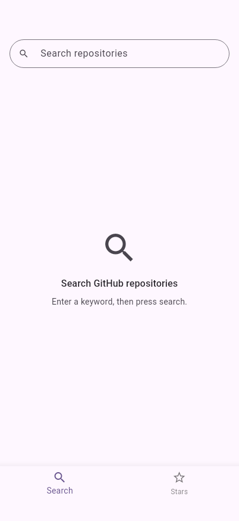
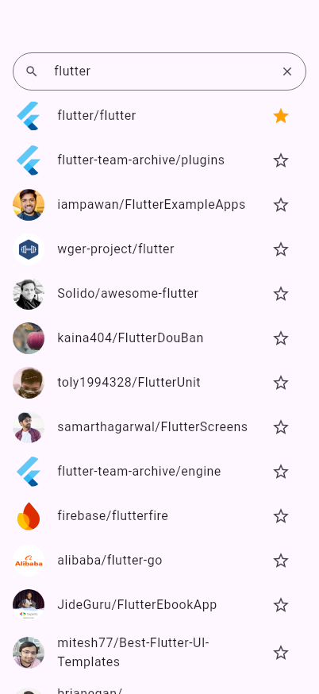
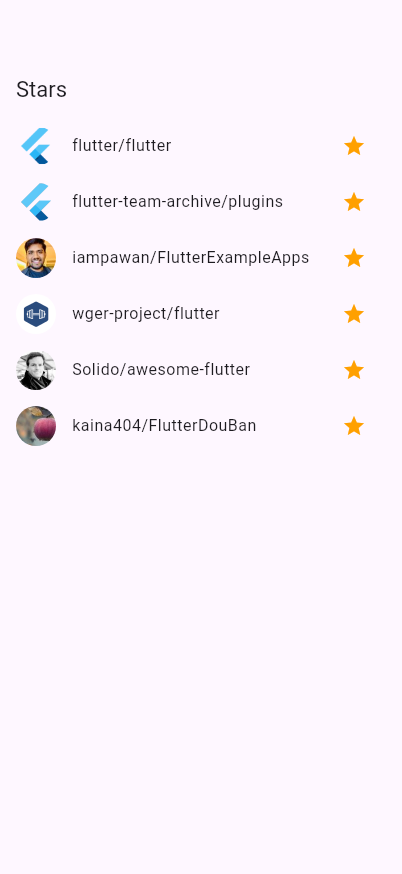
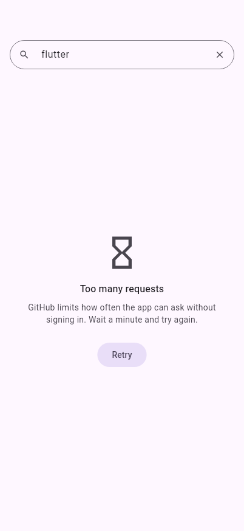
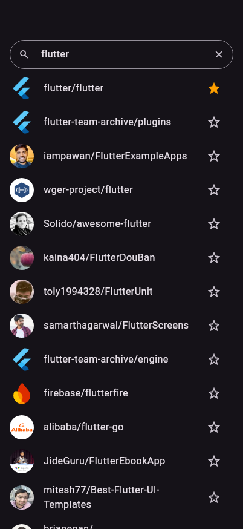
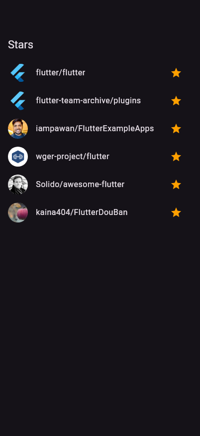
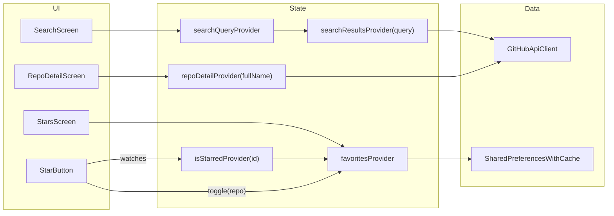

# GitHub Repo Viewer

[](https://github.com/ruby109/flutter_github_repo_viewer/actions/workflows/ci.yml)

A Flutter app for iOS and Android that searches GitHub repositories and keeps a list of local favorites. Stars are saved on the device and do not change your GitHub account's stars.

- **Search**: find public repositories through the GitHub REST API.
- **Stars**: save repositories locally and browse them later, offline.

**Contents:** [Screenshots](#screenshots) · [Getting Started](#getting-started) · [Key Implementation Points](#key-implementation-points) · [Packages](#packages) · [GitHub API](#github-api) · [Search](#search-screen) · [Detail](#detail-screen) · [Stars](#stars-screen) · [Favorites](#favorites) · [App Startup](#app-startup) · [Dark Mode](#dark-mode) · [Platform Conventions](#platform-conventions) · [Testing](#testing) · [Known Limitations](#known-limitations)

## Screenshots

Rendered by the golden tests from real GitHub data, at iPhone 17 size.

| Search | Results | Detail | Stars |
|---|---|---|---|
|  |  |  |  |

| Rate limited | Results, dark | Detail, dark | Stars, dark |
|---|---|---|---|
|  |  |  |  |

## Requirements

- Flutter 3.47.6 (stable channel), the version used by CI, with Dart 3.13.5. `pubspec.yaml` requires Dart `>=3.13.5 <4.0.0`.
- Xcode for the iOS simulator, Android Studio (or the Android SDK) for the Android emulator

## Getting Started

```sh
git clone https://github.com/ruby109/flutter_github_repo_viewer.git
cd flutter_github_repo_viewer
flutter pub get && flutter run    # pick a simulator/emulator, or pass -d <device-id>
```

No API key or configuration is needed: the app calls GitHub's public API without authentication.

Release-mode builds for local testing:

```sh
flutter build apk --release              # Android, build/app/outputs/flutter-apk/app-release.apk
flutter build ios --release --no-codesign  # iOS; sign and archive in Xcode to install on a device
```

The Android release configuration currently uses the debug signing key. Store distribution requires your own application ID and release signing configuration; iOS distribution also requires signing and provisioning in Xcode.

## Key Implementation Points

### Architecture

Three layers. Dependencies point downward (UI → state → data); nothing in a lower layer imports a higher one.

| Layer | Folder | Contains |
|---|---|---|
| Data | `lib/data/` | `GitHubApiClient` and its sealed `GitHubApiException`s, the models (`GitHubRepo`, `SearchPage`, `RepoDetail`), and the preferences loader. No widgets and no app state. |
| State | `lib/state/` | Riverpod providers and notifiers: the search query, search results, repository details and favorites. No widgets. |
| UI | `lib/ui/` | One folder per screen (`search`, `detail`, `stars`, `shell`, `startup`), shared widgets in `common`, and the themes. Widgets read and change state only through providers: they never call the API client or storage themselves. They do use data-layer types directly, such as the models, the exceptions (to word errors) and the page size. |

```
lib/
├── main.dart                     runApp, MyApp (themes, AppStartupWidget → HomeShell)
├── data/
│   ├── github/                   API client, models, exceptions, client providers
│   ├── avatars/                  disk cache for avatar images
│   └── preferences/              loading SharedPreferencesWithCache
├── state/                        search query/results, repo detail, favorites
└── ui/
    ├── shell/                    HomeShell: bottom navigation, a navigator per tab
    ├── search/  detail/  stars/  the three screens
    ├── startup/                  AppStartupWidget: loading, error and Retry
    ├── common/                   RepoAvatar, RepoListTile, StarButton, StatusMessage, error texts
    └── app_theme.dart            light and dark themes
```

How the pieces connect:



### State management

[hooks_riverpod](https://pub.dev/packages/hooks_riverpod) holds all shared state; hooks only hold a widget's own short-lived state (the search box's controller, the selected tab, each tab's navigator key).

| Provider | Kind | Why |
|---|---|---|
| `httpClientProvider`, `gitHubApiClientProvider` | `Provider` | Injects the HTTP client; tests override it with `MockClient` instead of touching the network. |
| `sharedPreferencesLoaderProvider` | `FutureProvider`, no automatic retry | Loads the preferences once at startup; Retry on the error screen loads again. |
| `sharedPreferencesProvider` | `Provider` | The loaded preferences, read synchronously everywhere after startup. |
| `searchQueryProvider` | `NotifierProvider<String>` | The submitted search text; empty means the home state. |
| `searchResultsProvider(query)` | `AsyncNotifierProvider`, `autoDispose` family, no automatic retry | One result set per keyword, so a new search never shows the previous one's results; also loads the next pages. |
| `repoDetailProvider(fullName)` | `FutureProvider`, `autoDispose` family, no automatic retry | Shared by screens showing the same repository; disposed when no screen listens to it. |
| `favoritesProvider` | `NotifierProvider<List<GitHubRepo>>` | The single owner of the starred list, and `toggle`. |
| `starredIdsProvider`, `isStarredProvider(id)` | `Provider`, then an `autoDispose` family | One repository's star, so a star button rebuilds only when its own star changes. |

Riverpod retries failed providers by default. That is turned off for everything that calls GitHub or storage: unauthenticated clients get 10 searches a minute and 60 other requests an hour, which silent retries would use up, so the user retries with a button instead.

### How favorites stay in sync

`favoritesProvider` is the only place stars live. The search list, the detail screen and the Stars tab all read it, and every star button changes it through `toggle(repo)`. The change shows on every screen at once, before it is saved; a failed save is reported in a SnackBar, and the notifier attempts to restore the stored list. Details are in [Favorites](#favorites).

### Navigation

`HomeShell` keeps each tab in an `IndexedStack` with its own `Navigator`, so the detail screen opens within the tab, under the navigation bar, and each tab keeps its screens while another is shown. Back closes the shown tab's screens; tapping the shown tab again returns to its first screen. Details are in [Detail Screen](#detail-screen).

### Edge cases

| Case | What happens |
|---|---|
| Rate limited (10 searches a minute, 60 detail requests an hour) | An error with Retry that says when to try again, if GitHub sent a time. No automatic retries. See [Errors](#errors). |
| More than 1,000 matches | Paging stops at GitHub's 1,000-result limit and the end of the list says so. See [Pagination](#pagination). |
| `total_count` overstates the results, or a page repeats a repository | An empty page ends paging; repeated repositories are skipped. |
| A page arrives after the search changed or reloaded | It is dropped. |
| Loading the next page fails | The loaded results stay; the end of the list shows the error with Retry. |
| Repository deleted after it was listed (404) | The detail screen says it no longer exists, without a pointless Retry. |
| Repository without an owner (`owner: null`) | A placeholder avatar. |
| Offline, or after a restart | Avatars seen before come from the disk cache; others show a placeholder until they load. |
| Stored favorites corrupt or from another version | Unreadable data loads as no favorites instead of crashing; valid entries are kept. |
| A favorite fails to save | A SnackBar says so; the notifier reloads storage when possible (see [Failed saves](#corrupt-data-and-failed-saves)). |
| Preferences fail to load at startup | An error screen with Retry instead of a launch screen that never goes away. |
| Large accessibility text, long names, tablets | Text wraps instead of overflowing; content is width-limited on wide screens. |
| Blank or whitespace-only search | The home state; no request is sent. |

## Packages

The assignment asks for `http` and `shared_preferences`, and `flutter_riverpod` or `hooks_riverpod`, and no other third-party packages unless they meaningfully improve the implementation.

| Package | Kind | Why |
|---|---|---|
| [http](https://pub.dev/packages/http) | Required | GitHub REST API calls. Its `MockClient` also replaces the network in tests. |
| [shared_preferences](https://pub.dev/packages/shared_preferences) | Required | Stores the starred repositories on the device (`SharedPreferencesWithCache`). |
| [hooks_riverpod](https://pub.dev/packages/hooks_riverpod) | Required | State management and dependency injection. |
| [flutter_hooks](https://pub.dev/packages/flutter_hooks) | Added | `hooks_riverpod` is built on it and already depends on it, so it adds no code to the app; it is listed only so the app can import it. Hooks keep a widget's own short-lived state with no `StatefulWidget` boilerplate and no forgotten `dispose`: the search box's `TextEditingController` (`useTextEditingController`), the selected tab (`useState`) and each tab's navigator key (`useMemoized`). |
| [riverpod_lint](https://pub.dev/packages/riverpod_lint) | Added, analyzer plugin only | Flags Riverpod mistakes while coding, such as a family parameter without value equality (which would create a new provider on every rebuild), a matching pattern on an `AsyncValue` that mishandles null values, public state on a notifier, or a missing `ProviderScope`. It runs in `dart analyze` and adds nothing to the app. |
| [flutter_lints](https://pub.dev/packages/flutter_lints) | Dev only | Flutter's recommended lints, from the project template. |
| [shared_preferences_platform_interface](https://pub.dev/packages/shared_preferences_platform_interface) | Dev only | shared_preferences' own platform package, already a transitive dependency. Tests use its in-memory store (see [Testing favorites](#testing-favorites)). |

Packages not used, and what the app does instead:

| Common choice | Instead |
|---|---|
| go_router (`StatefulShellRoute`) | A `Navigator` per tab in `HomeShell`, with `NavigatorPopHandler` for system back |
| cached_network_image | A small disk cache, `AvatarCache`, behind an `ImageProvider`, with avatars requested and decoded at the size shown (see [Avatars](#avatars)) |
| intl | A small thousands-separator formatter for the subscriber count |
| freezed, json_serializable | Hand-written `fromJson` with Dart 3 patterns, which validates the few fields the app uses |
| mocktail, fake_async | `MockClient` from `http`, small hand-written fakes, and test-controlled `Completer`s |
| golden_toolkit, alchemist | Flutter's built-in `matchesGoldenFile`, with a small helper for device sizes and fonts (`test/helpers/golden_devices.dart`) |

## GitHub API

The app calls two public endpoints of the [GitHub REST API](https://docs.github.com/en/rest) through `GitHubApiClient` (`lib/data/github/`). Requests are unauthenticated, so there is no token to configure. Every request sends `Accept: application/vnd.github+json` and `X-GitHub-Api-Version: 2022-11-28` and times out after 15 seconds. Response bodies are decoded as UTF-8, as JSON requires, whatever the `content-type` header says.

### Search repositories

[`GET /search/repositories`](https://docs.github.com/en/rest/search/search#search-repositories): `searchRepositories(query, page:)` returns a `SearchPage`.

| Parameter | Value |
|---|---|
| `q` | The search box text. A blank query is rejected before sending, since GitHub answers it with 422; the screen shows its home state instead. |
| `page` | 1 to 10. Pages past the 1000-result limit are rejected before sending. |
| `per_page` | 100, the most GitHub allows, so scrolling spends as few of the 10 searches a minute as possible |

Fields used from each item (`GitHubRepo`):

| JSON | Dart | Notes |
|---|---|---|
| `id` | `id` | Identifies a starred repository |
| `full_name` | `fullName` | `owner/name` |
| `owner.avatar_url` | `owner?.avatarUrl` | GitHub documents `owner` as nullable |

`SearchPage.hasMore` controls infinite scrolling. It is false on the last page, on an empty page, and after 1000 results: the Search API returns at most 1000 results per query, however large `total_count` is, and later pages fail with 422.

### Get a repository

[`GET /repos/{owner}/{repo}`](https://docs.github.com/en/rest/repos/repos#get-a-repository): `fetchRepository(fullName)` returns a `RepoDetail`, which holds the same `GitHubRepo` fields plus `subscribers_count` (`subscribersCount`), a field search results don't include.

### Errors

Every failure is a subclass of the sealed `GitHubApiException`, so screens can `switch` over all of them:

| Exception | When | Shown as |
|---|---|---|
| `RateLimitException` | 429, or 403 with `retry-after`, `x-ratelimit-remaining: 0` or a rate limit message. `retryAt` comes from `retry-after` or `x-ratelimit-reset` when GitHub sends them. | "Too many requests", with the time to try again in the device's 12- or 24-hour format, or "Wait a minute"; Retry |
| `NotFoundException` | 404, e.g. a repository deleted after it was listed | "This repository no longer exists"; no Retry on the detail screen |
| `HttpStatusException` | Any other non-2xx status, including a 403 that isn't rate limiting | "Something went wrong", with the status code; Retry |
| `NetworkException` | No connection, a dropped connection, a TLS failure, or a timeout | "No connection"; Retry |
| `MalformedResponseException` | A 2xx body that isn't JSON or lacks required fields | "Something went wrong"; Retry |

`describeError` (`lib/ui/common/error_message.dart`) turns each exception into these texts, so every screen words errors the same way.

Unauthenticated clients get [10 searches a minute](https://docs.github.com/en/rest/search/search#rate-limit) and [60 other requests an hour](https://docs.github.com/en/rest/using-the-rest-api/rate-limits-for-the-rest-api#primary-rate-limit-for-unauthenticated-users) per IP address, so rate limiting is an expected state, not an edge case.

### Using the client and testing with it

`gitHubApiClientProvider` provides the client, built on `httpClientProvider`, which closes the `http.Client` when its container is disposed. Tests override either provider instead of touching the network; the API tests use `MockClient` from `package:http/testing.dart`, which ships with `http`:

```dart
ProviderScope(
  overrides: [
    httpClientProvider.overrideWithValue(
      MockClient((request) async => http.Response('{"total_count":0,"items":[]}', 200)),
    ),
  ],
  child: const MyApp(),
);
```

## Search Screen

The Search tab (`lib/ui/search/`) searches repositories by keyword. Its state is in `lib/state/search_query_notifier.dart` and `lib/state/search_results_notifier.dart`.

### States

| State | When |
|---|---|
| Home | The search box is empty or blank. Deleting the text returns here at once. |
| Loading | The first page of a search is loading, or a failed search is being retried. |
| Results | Each row shows the owner avatar, `full_name` and a star button. Tapping a row opens its [details](#detail-screen). |
| No results | GitHub found nothing for the keyword. |
| Error | The search failed. The message comes from the error type (no connection, rate limited, ...), with a Retry button. When rate limited, it says when to try again if GitHub sent a time. |

### When it searches

- **Only when the keyboard's search key is pressed**, not while typing. Unauthenticated clients get 10 searches a minute, which typing would use up in a few words.
- **No automatic retries.** Riverpod retries failed providers by default, which would also spend the 10 searches; the user retries instead.
- **One result set per keyword.** `searchResultsProvider` is an `autoDispose` family keyed by the keyword, so a new search starts empty and never shows the previous keyword's results. A keyword's results are dropped once the screen stops showing them.

### Pagination

`SearchResultsNotifier.loadNextPage()` appends the next page (100 results), and the list calls it as rows are built:

- **When:** once one of the last 50 rows (half a page) is built, several screens before the end, so the next page arrives before even a fast scroll gets there. Checking as rows are built, rather than on scroll, also loads more when the first page doesn't fill the screen.
- **At most one request at a time.** `loadNextPage` does nothing while a page or the search itself is loading, so the list can call it freely.
- **Failed pages.** The loaded results stay, and the end of the list shows the error with a Retry button. Scrolling doesn't request the page again; only Retry does.
- **Duplicates.** Results can shift between requests, so a page may repeat a repository; it is skipped.
- **Stale pages.** A page that arrives after the search reloaded is dropped.
- **The 1,000-result limit.** GitHub returns at most 1,000 results per search. When paging stops there while `total_count` is larger, the end of the list says only the first 1,000 results are shown and suggests a more specific search.
- **The end.** Once every result has been loaded, the end of the list says there are no more results.

### Avatars

`RepoAvatar` asks GitHub's avatar host for an image the size it is shown (the `s` parameter) and decodes it at that size, instead of the default 460 pixels. A placeholder shows while it loads, if it fails, or when a repository has no owner.

Avatars are cached in two layers, like SDWebImage:

| Layer | What | Details |
|---|---|---|
| Memory | Flutter's `ImageCache` | Decoded images, keyed by URL and size; up to 1,000 images or 100 MB, least recently used first out. Concurrent loads of one image share one request. |
| Disk | `AvatarCache` (`lib/data/avatars/`) | The downloaded bytes, one file per avatar and size, in the system's temporary directory (which the OS may clear when storage runs low, as caches allow). |

How the disk cache behaves:

- **One avatar, several sizes.** GitHub resizes avatars on request, so the list (40 points) and the detail screen (96 points) ask for different sizes. Like SDWebImage, which keeps one original and decodes each size from it, the cache looks at every size it has before downloading: a fresh larger one is scaled down instead of downloading a smaller one, and offline any cached size is shown, a smaller one scaled up rather than a placeholder.
- **Freshness.** A file is used as is for 7 days, as GitHub can change an avatar without changing its URL, then downloaded again; if that fails, as when offline, the old file is still shown.
- **Size limit.** When the app goes to the background, files past 20 MB are removed, least recently used first, along with temporary files over a minute old, left by an interrupted write (newer ones may still be being written). Trimming is upkeep: a file system error just ends it. Old files otherwise stay: offline, they are all there is.
- **Safety.** Each download is written to its own temporary file and renamed, so a half-written file is never read. A cached file that can't be read (e.g. trimmed a moment earlier) counts as not cached. A download that isn't a valid image is removed when it fails to decode, so the next attempt downloads it again.

`CachedAvatarImage` connects the two layers: an `ImageProvider` that loads through `AvatarCache`. Decoding runs in the engine, off the UI isolate, and the `Image` widget defers loading while the list scrolls fast.

Requests for rows that scroll away before their avatar arrives aren't cancelled; their results land in the caches for when the rows come back. Cancelling them, as `flutter_map` does with `package:http`'s `AbortableRequest`, would also need counting the rows that share an avatar, since one in-flight request serves them all. Avatars are a few KB each, so the saving is small.

### Testing the screen

- `test/fixtures/` holds a real Search API response for `flutter`, the Repository API response for its first result, and their owners' avatars, saved by `dart run tool/fetch_fixtures.dart`. The parsers and the golden tests use them.
- `AvatarFixtures` (`test/helpers/avatars.dart`) serves those avatars through a real `AvatarCache` over a temporary directory, so goldens show real images and tests can go offline.
- Golden tests cover the results, no results and rate limited states, and both ends of the list (every result shown, and the 1,000-result limit), at every device size. The detail screen has goldens for loaded, loading, rate limited and not found.

## Detail Screen

Tapping a search result opens `RepoDetailScreen` (`lib/ui/detail/`) within the tab, under the navigation bar.

- **Each tab has its own navigator** (`HomeShell`), so a tab keeps the screens opened in it while another tab is shown, and returns to the list where it was left.
- **Back:** the back button, the iOS edge swipe and Android's system back close the shown tab's screens; system back on a tab's first screen is left to the system. Hidden tabs are never popped.
- **Tapping the shown tab again** returns to its first screen, as in iOS apps.

On the screen:

- **Shown at once:** the owner avatar (96 pixels), `full_name` and the star button come from the search result, so they don't wait for the network.
- **Copying the name:** long-pressing `full_name` shows the platform's copy menu (the edit menu on iOS, the text toolbar on Android); Copy copies the whole name. The app uses a menu rather than selectable text, because selecting text would select only the word under the finger.
- **Loaded:** `subscribers_count` comes from the Repository API through `repoDetailProvider` (`lib/state/repo_detail_provider.dart`), an `autoDispose` family keyed by full name, so reopening a repository fetches its count again once no other screen is listening to that repository. A detail screen retained in the other tab can keep the same provider alive. Like search, it never retries on its own: unauthenticated clients get 60 of these requests an hour.
- **States of the subscriber count:** a loading indicator; the count with thousands separators; or the error with a Retry button. A deleted repository (404) says it no longer exists and offers no retry, since retrying can't bring it back. The rest of the screen, including the star, stays usable.
- **Stars stay in sync:** the star button watches the same `isStarredProvider(id)` as the list rows, so starring here shows in the list on returning, without reloading anything.
- **Wide screens:** the content is at most 560 pixels wide, centered, so it stays readable on an iPad.

## Stars Screen

The Stars tab (`lib/ui/stars/`) lists the starred repositories, most recently starred first, from `favoritesProvider`.

- **Unstarring** a repository with its star button removes its row at once and saves the change (see [Favorites](#favorites)).
- **Empty state** when nothing is starred, pointing to Search.
- **In sync with the other screens:** it watches `favoritesProvider`, so stars added or removed in Search or on the detail screen show immediately, and unstarring here updates their star buttons. Widget tests drive the whole shell to check this end to end.
- **Tapping a row** opens the [detail screen](#detail-screen), as in Search.
- Stars are stored on the device, so the tab works offline, and avatars seen before come from the [disk cache](#avatars).

## Favorites

Starred repositories are stored on the device with `shared_preferences`. GitHub's own starring API isn't used, so no account is needed. The code is in `lib/state/favorites_notifier.dart`.

### Storage

All favorites are stored under one key, `favorites`, as a JSON array of the fields the app shows:

```json
[
  {"id": 2, "full_name": "dart-lang/sdk", "owner": null},
  {"id": 1, "full_name": "flutter/flutter", "owner": {"avatar_url": "https://avatars.githubusercontent.com/u/14101776?v=4"}}
]
```

- Entries use the GitHub API's own field names and are read back with `GitHubRepo.fromJson`, so the API and storage share one parser.
- The list is ordered most recently starred first. The assignment doesn't specify an order. The array keeps the order, so no timestamp is stored.
- Every change rewrites the whole array. shared_preferences can only replace a key's whole value, and one write always stores one complete list. Saves run one at a time, in order, so an older list can never finish last and overwrite a newer one.
- The preferences (`SharedPreferencesWithCache`, limited to the `favorites` key) are loaded once while the app starts, before any screen shows (see [App Startup](#app-startup)). From then on favorites are read synchronously through `sharedPreferencesProvider`, so no screen has a loading state for them.

### Keeping screens in sync

`favoritesProvider` (`FavoritesNotifier`) is the only owner of the starred list. Every screen reads from it and stars through `toggle(repo)`, which matches repositories by `id`. The change shows on every screen immediately, before it is saved.

| Provider | Use |
|---|---|
| `favoritesProvider` | The starred list, for the Stars tab, and `toggle` |
| `isStarredProvider(id)` | Whether one repository is starred, for a star icon |

`isStarredProvider` is an `autoDispose` family over a set of starred ids:

- **Narrow rebuilds.** It notifies only when that repository's star changes, so starring one row doesn't rebuild the others.
- **Bounded memory.** It is disposed when a row scrolls away, so ids from long search results don't accumulate.

### Corrupt data and failed saves

- **Unreadable stored data** (not JSON, not an array, or the wrong type) loads as no favorites instead of crashing. Invalid entries and duplicate ids are skipped, and the valid entries are kept. The bad data is replaced on the next change.
- **Failed saves.** If a save fails, `toggle` throws so the UI can tell the user. The notifier attempts to reload storage and applies the stored list if no other save is pending. If reloading also fails, it keeps the current in-memory list; the next successful save persists that list. It doesn't undo just the failed change, because a later save writes the whole list and may already contain it.

### How many favorites it handles

Every change encodes the whole list as JSON on the UI isolate and writes it; startup decodes it once. Measured on an iPhone in a profile build, with worst-case entries (140-character names), median of 7 runs. "UI blocked" is the longest time the UI isolate couldn't draw; a frame is 16.7 ms at 60 Hz and 8.3 ms at 120 Hz.

| Favorites (stored size) | Save, UI blocked | Load at startup |
|---|---|---|
| 1,000 (245 KB) | 2–3 ms | 2.5 ms |
| 10,000 (2.4 MB) | 17 ms | 17 ms |

- **Up to a few thousand favorites, nothing to optimize.** Saving and loading take a few milliseconds. Favorites are starred one tap at a time, so real lists are far smaller.
- **Around 10,000, each star costs about one frame** at 60 Hz (two at 120 Hz). Loading also takes 17 ms, but once, behind the startup background, so it doesn't show.

Options measured for larger lists, and why none is used:

| Option | Effect | Cost |
|---|---|---|
| Encode in a background isolate (`Isolate.run`) | Saving 10,000: UI blocked 17 → 4 ms. Loading in an isolate: 17 → 3 ms. At 1,000 the UI time doesn't change and the total time grows by ~2 ms (starting an isolate). | More moving parts in saving and loading, and widget tests must run isolates under `runAsync`, for no gain at real sizes. The first thing to add if lists grow. |
| A compact format (`[id, full_name, avatar user id]` instead of GitHub's fields and the full avatar URL) | 34–64% smaller; encoding ~35–40% faster, decoding 50–70% faster (measured on a Mac) | The assignment asks to store `owner.avatar_url`; the URL would have to be rebuilt from GitHub's format; storage could no longer share `GitHubRepo.fromJson` with the API; stored data would need migrating. Less gain than an isolate. |
| A database with per-row writes (e.g. SQLite) | Each change writes one row instead of the whole list | Another package, and the assignment asks for shared_preferences, which is meant for small data anyway. The fix if lists grew to tens of thousands. |

So the list is kept as plain JSON in shared_preferences, encoded on the UI isolate, and moving the encoding to an isolate is the first step if favorites ever need to scale.

### Testing favorites

Tests replace the platform store with `InMemorySharedPreferencesAsync` from [shared_preferences_platform_interface](https://pub.dev/packages/shared_preferences_platform_interface). It is shared_preferences' own platform package, which the app already depends on through shared_preferences; it is also listed as a dev dependency only so tests can import its in-memory backend directly. `test/helpers/preferences.dart` also has a store whose writes and reads a test can hold, fail or complete in any order, to cover concurrent saves.

## App Startup

`main()` calls `runApp` at once. `AppStartupWidget` (`lib/ui/startup/`) then loads the preferences through `sharedPreferencesLoaderProvider` and shows the app once they have loaded.

| State | Shows |
|---|---|
| Loading | A plain background, the same as the native launch screen, with no spinner, so a fast load looks like the launch screen staying a moment longer. It is white in light mode and black in dark mode, like the iOS launch screen (`systemBackground`) and the Android launch themes (`values` and `values-night`); tests keep the three in sync. |
| Failed | An error with a Retry button. Retry loads again; Riverpod's automatic retries are off, so a failing load doesn't keep the user waiting on a blank screen. |
| Loaded | The app (`HomeShell`) |

- **Why preferences load before the app shows.** Favorites are read from them. Loading them first means `sharedPreferencesProvider` reads synchronously (`requireValue` on the loaded value), so no screen needs a loading state for favorites and a star never flickers from empty to filled.
- **Why not before `runApp`.** If loading throws (e.g. a corrupt preferences file or a platform channel error), `runApp` would never run and the app would stay on the native launch screen until the user killed it.

## Dark Mode

The app follows the system's light or dark mode; there is no in-app switch.

- **Themes:** `AppTheme` (`lib/ui/app_theme.dart`) builds a light and a dark Material 3 theme from the same seed color, and `MyApp` passes both to `MaterialApp`. Widgets take their colors from the theme's color scheme. The only fixed colors are the star's amber, which reads well on both backgrounds, and the startup loading background, which is white or black on purpose to match the native launch screens.
- **Launch:** the native launch screens and the startup loading background are white in light mode and black in dark mode (see [App Startup](#app-startup)), so nothing flashes on the way to the first screen.
- **Goldens:** golden tests render with the app's own themes, and the main screens also have dark goldens.

## Platform Conventions

Material 3 throughout, with the platform's own behavior where users notice it:

- **Navigation:** the back button shows the platform's arrow, iOS pages slide in from the right and close with the edge swipe, and Android's system back closes the shown tab's screens first. Tapping the shown tab again returns to its first screen.
- **Tab bar:** a Material 3 `NavigationBar`, which marks the selected tab with an indicator behind its icon, so it is obvious even for the Search tab, whose icon doesn't change.
- **Loading indicators** are adaptive: the iOS activity indicator on iOS, Material's on Android.
- **Copy menu:** long-pressing a repository's name shows the platform's own menu (see [Detail Screen](#detail-screen)).
- **App icon:** an amber star on the app's purple. `tool/generate_app_icon.py` (Python with Pillow) draws every iOS size and the Android icons, including an adaptive icon with a monochrome layer for themed icons.

## Development Setup

Git hooks that format, analyze and test your changes, and check commit messages, are managed by [lefthook](https://lefthook.dev):

```sh
brew install lefthook
lefthook install
```

See [AGENTS.md](AGENTS.md) for exactly what each hook runs.

## Testing

```sh
dart format --output=none --set-exit-if-changed .  # check formatting
flutter test --exclude-tags golden    # unit and widget tests
dart analyze --fatal-infos            # analyzer, including riverpod_lint
```

- **Unit tests** cover the API client (requests, parsing, every error), the models, and every provider and notifier, including concurrent saves and pages arriving out of order.
- **Widget tests** cover every screen and shared widget through its public API, and drive the whole `HomeShell` end to end: search, open a repository, star it, and see the star on every tab.
- **Golden tests** render the key states of every screen (loading and loaded states are also checked by widget tests) at iPhone 17, iPhone SE, iPad and Android phone sizes, the main screens also in dark mode. Font rendering differs between operating systems, so they run only on Linux CI, for every pull request. After an intended UI change, push the branch and regenerate them there:

  ```sh
  scripts/update-goldens.sh
  ```

  This requires the GitHub CLI (`gh`), authenticated with access to run workflows on this repository. Run it from the branch you pushed; it regenerates the images on Linux, commits them remotely and pulls that commit with `--ff-only`.

- **Real data, no network:** `test/fixtures/` holds real GitHub responses and avatars (refresh with `dart run tool/fetch_fixtures.dart`); `MockClient` and `withAvatarFixtures` serve them.

CI runs format, analyze and the tests on every push to `main` and on pull requests.

## Known Limitations

- **Rate limits.** Without signing in, GitHub allows 10 searches a minute and 60 other requests an hour per IP address. The app makes few requests (search only on submit, 100 results a page, no automatic retries) and explains the limit when it is reached, but cannot raise it.
- **1,000 results per search**, GitHub's limit; the list says so when it is reached.
- **Stars are local** to the device, as the assignment asks; they are not synced with the user's GitHub stars.
- **No undo** after unstarring in the Stars tab.
- **Very large favorites lists.** Around 10,000 favorites, each star costs about one frame on an iPhone (see [How many favorites it handles](#how-many-favorites-it-handles)); far more than starring one at a time produces.
- **Scrolling performance** has not yet been profiled on devices; that is tracked in [#11](https://github.com/ruby109/flutter_github_repo_viewer/issues/11).

## Contributing

Commit conventions and other rules for contributors (human or AI agent) are in [AGENTS.md](AGENTS.md).
